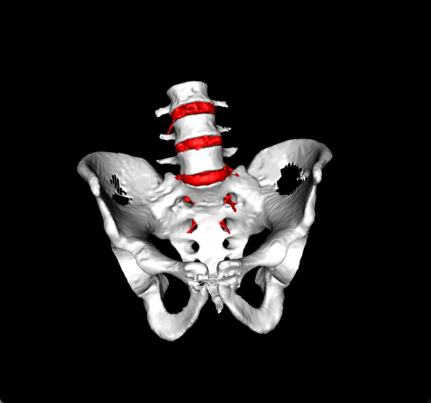

# My Projects

## Project 1: [Bladder Cancer Proteomics](https://github.com/your-username/project1)

  
  

    <h4>Subpopulation and Feature Detection</h4>
    
Given a clinical dataset with bladder cancer patients, we identify 7 subpopulations. We infer from proteomics and metadata, the most informative features.

    <a href="https://github.com/tudi72/Bladder_Subpopulation_Detection" target="_blank">View on GitHub</a>
  

## Project 2: [Mini NERF](https://github.com/your-username/project2)

  
  

    <h4>Bulldozer Neural Radial Field</h4>
    
Based on NERF paper, we reconstruct the point cloud from views of complex scenes using 5D coordinates. 

    <a href="https://github.com/tudi72/2023_MINI_NERF" target="_blank">View on GitHub</a>
  

## Project 3: [Computer-Assisted Surgery Pipeline](https://github.com/your-username/project3)

  
  

    <h4>Preoperative Planning </h4>
    
We apply pivot calibration, Region-Growing segmentation with seed, Point Cloud Registration and U-NET segmentation deep learning for reference.

    <a href="https://github.com/tudi72/Computer_Assisted_Surgery" target="_blank">View on GitHub</a>
  

