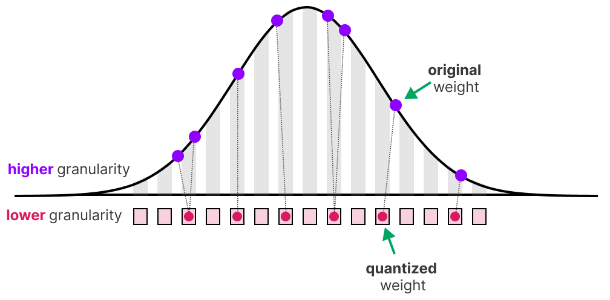
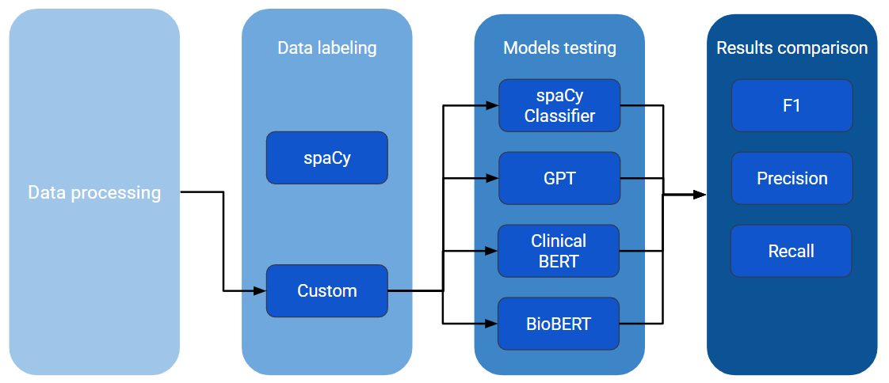
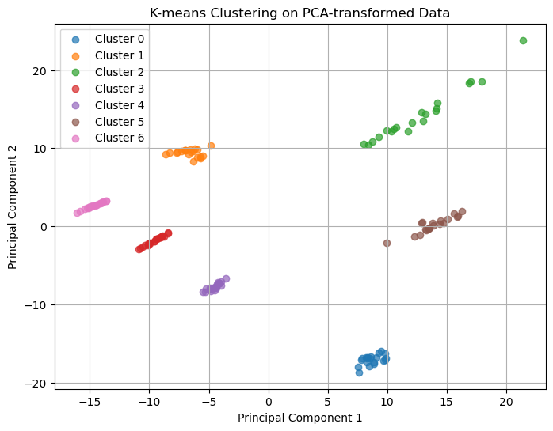
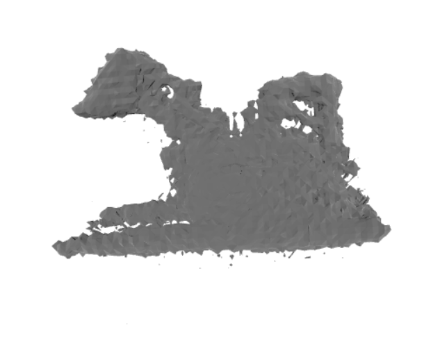
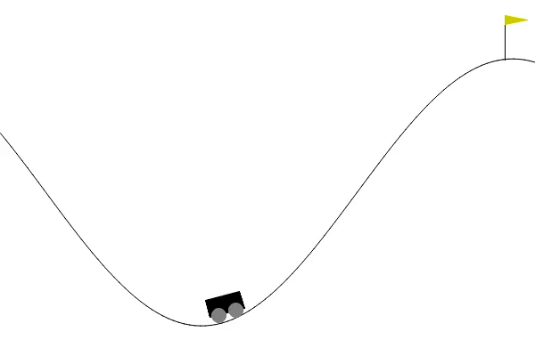

## About Me
- Aspiring ML Engineer & Data Scientist with industry experience at Johnson & Johnson in MSAT Process Modeling. 
- Msc. in Artificial Intelligence at University of Bern, under the umbrella of [CAIM](https://www.caim.unibe.ch/) and [ARTORG](https://www.artorg.unibe.ch/).  
- I am currently working on clustering algorithms for **subtype and stage inference** for FDG-PET images of Amyotrophic Lateral Sclerosis patients, under the supervision of [Prof. Dr. Kuangyu Shi](https://nukmed.insel.ch/de/ueber-uns/unser-team/details/person/detail/kuangyu-shi) and [Postdoc. Jimin Hong](https://nukmed.insel.ch/de/ueber-uns/unser-team/details/person/detail/jimin-hong).
- I have received a Bachelor's degree in Computer Engineering at [Technical University of Cluj-Napoca](https://www.utcluj.ro/), Romania. My dissertation was based on **Self-Supervised Learning for Heart Arrythmia Detection and Classification**, advised by prof. [Cristian Vicas](https://cs.utcluj.ro/old/educatie/csd/site/pageb2be.html?pid=253).  
- During my bachelor, I interned at Siemens, mentored by [Irina Emilia Nicolae](https://www.linkedin.com/in/irina-emilia-nicolae/?originalSubdomain=ro), where I discovered my passion for Artificial Intelligence while working on Machine Learning methods for EKG data.

## Projects 
- **[LegalBert Text Summarization ](https://github.com/tudi72/NLP_summarization_LegalBERT)**

  
  

    <h4>Quantized INT8  method for LegalBert inference </h4>
    
Technologies used are PyTorch, Transformers,BitNet, BERT, HuggingFace, Wandb.

    <a href="https://github.com/tudi72/NLP_summarization_LegalBERT" target="_blank">View on GitHub</a>
  

- **[Medical Corpus NLP](https://github.com/tudi72/Medical_NER)**

  
  

    <h4>Named-Entity Recognition for Custom Labels </h4>
    
Technologies used are Spacy, NLTK, BERT, GPT, Label-Studio, Wandb, HuggingFace.

    <a href="https://github.com/tudi72/Medical_NER" target="_blank">View on GitHub</a>
  

- **[Bladder Cancer Proteomics](https://github.com/tudi72/Bladder_Subpopulation_Detection)**

  
  

    <h4>Subpopulation and Feature Detection</h4>
    
Given a clinical dataset with bladder cancer patients, we identify 7 subpopulations. We infer from proteomics and metadata, the most informative features.

    <a href="https://github.com/tudi72/Bladder_Subpopulation_Detection" target="_blank">View on GitHub</a>
  

- **[Computer-Assisted Surgery Pipeline](https://github.com/tudi72/Computer_Assisted_Surgery)**

  
  

    <h4>Preoperative Planning </h4>
    
We apply pivot calibration, Region-Growing segmentation with seed, Point Cloud Registration and U-NET segmentation deep learning for reference.

    <a href="https://github.com/tudi72/Computer_Assisted_Surgery" target="_blank">View on GitHub</a>
  

- **[Mini NERF](https://github.com/tudi72/2023_MINI_NERF)**

  
  

    <h4>Bulldozer Neural Radial Field</h4>
    
Based on NERF paper, we reconstruct the point cloud from views of complex scenes using 5D coordinates. 

    <a href="https://github.com/tudi72/2023_MINI_NERF" target="_blank">View on GitHub</a>
  

- **[Mountain Car DQN](https://github.com/tudi72/RL_DQN_MountainCar)**

 
  
  

    <h4>Deep Q-Learning and REINFORCE</h4>
    
More description

    <a href="https://github.com/tudi72/RL_DQN_MountainCar" target="_blank">View on GitHub</a>
  

